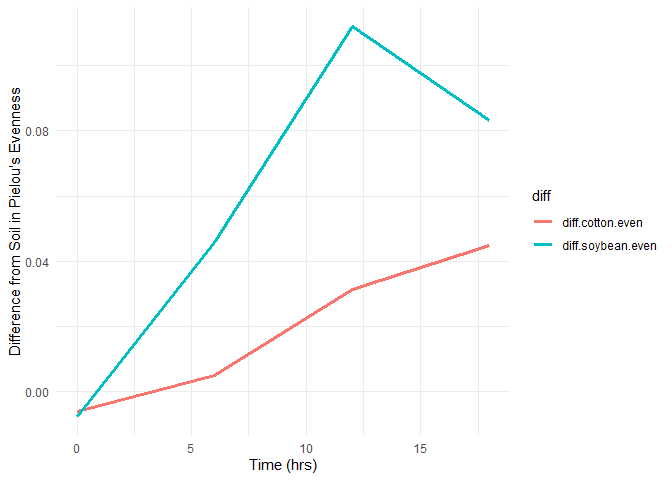

Question 1. Download two .csv files from Canvas called DiversityData.csv
and Metadata.csv, and read them into R using relative file paths.

``` r
# loading reuired packages
library(tidyverse)
```

    ## Warning: package 'tidyr' was built under R version 4.5.2

    ## Warning: package 'readr' was built under R version 4.5.2

    ## Warning: package 'purrr' was built under R version 4.5.2

    ## Warning: package 'stringr' was built under R version 4.5.2

    ## ── Attaching core tidyverse packages ──────────────────────── tidyverse 2.0.0 ──
    ## ✔ dplyr     1.1.4     ✔ readr     2.1.6
    ## ✔ forcats   1.0.0     ✔ stringr   1.6.0
    ## ✔ ggplot2   4.0.2     ✔ tibble    3.3.0
    ## ✔ lubridate 1.9.4     ✔ tidyr     1.3.2
    ## ✔ purrr     1.2.1     
    ## ── Conflicts ────────────────────────────────────────── tidyverse_conflicts() ──
    ## ✖ dplyr::filter() masks stats::filter()
    ## ✖ dplyr::lag()    masks stats::lag()
    ## ℹ Use the conflicted package (<http://conflicted.r-lib.org/>) to force all conflicts to become errors

``` r
# Reading csv files
diversity <- read.csv("DiversityData.csv")
metadata <- read.csv("Metadata.csv")
```

Question 2. Join the two dataframes together by the common column
‘Code’. Name the resulting dataframe alpha.

``` r
# Joining the two dataframes together by the common column ‘Code’
alpha <- left_join(diversity, metadata, by = "Code")
head(alpha)
```

    ##     Code  shannon invsimpson   simpson richness Crop Time_Point Replicate
    ## 1 S01_13 6.624921   210.7279 0.9952545     3319 Soil          0         1
    ## 2 S02_16 6.612413   206.8666 0.9951660     3079 Soil          0         2
    ## 3 S03_19 6.660853   213.0184 0.9953056     3935 Soil          0         3
    ## 4 S04_22 6.660671   204.6908 0.9951146     3922 Soil          0         4
    ## 5 S05_25 6.610965   200.2552 0.9950064     3196 Soil          0         5
    ## 6 S06_28 6.650812   199.3211 0.9949830     3481 Soil          0         6
    ##   Water_Imbibed
    ## 1            na
    ## 2            na
    ## 3            na
    ## 4            na
    ## 5            na
    ## 6            na

Question 3. Calculate Pielou’s evenness index: Pielou’s evenness is an
ecological parameter calculated by the Shannon diversity index (column
Shannon) divided by the log of the richness column. a. Using mutate,
create a new column to calculate Pielou’s evenness index. b. Name the
resulting dataframe alpha_even.

``` r
# Creating a new dataframe and calculating Pielou’s evenness index
alpha_even <- alpha %>%
  mutate(even = shannon / log(richness))
head(alpha_even)
```

    ##     Code  shannon invsimpson   simpson richness Crop Time_Point Replicate
    ## 1 S01_13 6.624921   210.7279 0.9952545     3319 Soil          0         1
    ## 2 S02_16 6.612413   206.8666 0.9951660     3079 Soil          0         2
    ## 3 S03_19 6.660853   213.0184 0.9953056     3935 Soil          0         3
    ## 4 S04_22 6.660671   204.6908 0.9951146     3922 Soil          0         4
    ## 5 S05_25 6.610965   200.2552 0.9950064     3196 Soil          0         5
    ## 6 S06_28 6.650812   199.3211 0.9949830     3481 Soil          0         6
    ##   Water_Imbibed      even
    ## 1            na 0.8171431
    ## 2            na 0.8232216
    ## 3            na 0.8046776
    ## 4            na 0.8049774
    ## 5            na 0.8192376
    ## 6            na 0.8155427

Question 4. Using tidyverse language of functions and the pipe, use the
summarise function and tell me the mean and standard error evenness
grouped by crop over time. a. Start with the alpha_even dataframe b.
Group the data: group the data by Crop and Time_Point. c. Summarize the
data: Calculate the mean, count, standard deviation, and standard error
for the even variable within each group. d. Name the resulting dataframe
alpha_average

``` r
alpha_average <- alpha_even %>%
  group_by(Crop, Time_Point) %>%    # grouping the data by Crop and Time_Point
  summarise(                        # Summarizing the data
    mean.even = mean(even),
    n = n(),
    sd = sd(even),
    se = sd / sqrt(n)
  )
```

    ## `summarise()` has grouped output by 'Crop'. You can override using the
    ## `.groups` argument.

``` r
head(alpha_average)              # plotting the head of the resulting dataframe
```

    ## # A tibble: 6 × 6
    ## # Groups:   Crop [2]
    ##   Crop   Time_Point mean.even     n      sd      se
    ##   <chr>       <int>     <dbl> <int>   <dbl>   <dbl>
    ## 1 Cotton          0     0.820     6 0.00556 0.00227
    ## 2 Cotton          6     0.805     6 0.00920 0.00376
    ## 3 Cotton         12     0.767     6 0.0157  0.00640
    ## 4 Cotton         18     0.755     5 0.0169  0.00755
    ## 5 Soil            0     0.814     6 0.00765 0.00312
    ## 6 Soil            6     0.810     6 0.00587 0.00240

Question 5. Calculate the difference between the soybean column, the
soil column, and the difference between the cotton column and the soil
column a. Start with the alpha_average dataframe b. Select relevant
columns: select the columns Time_Point, Crop, and mean.even. c. Reshape
the data: Use the pivot_wider function to transform the data from long
to wide format, creating new columns for each Crop with values from
mean.even. d. Calculate differences: Create new columns named
diff.cotton.even and diff.soybean.even by calculating the difference
between Soil and Cotton, and Soil and Soybean, respectively. e. Name the
resulting dataframe alpha_average2

``` r
alpha_average2 <- alpha_average %>%
  select(Time_Point, Crop, mean.even) %>%   # selecting relevant columns
  pivot_wider(names_from = Crop, values_from = mean.even) %>%   # pivoting wider
  mutate(                                   # calculating differences
    diff.cotton.even = Soil - Cotton,
    diff.soybean.even = Soil - Soybean
  )
head(alpha_average2)                # plotting the head of the resulting dataframe
```

    ## # A tibble: 4 × 6
    ##   Time_Point Cotton  Soil Soybean diff.cotton.even diff.soybean.even
    ##        <int>  <dbl> <dbl>   <dbl>            <dbl>             <dbl>
    ## 1          0  0.820 0.814   0.822         -0.00602          -0.00740
    ## 2          6  0.805 0.810   0.764          0.00507           0.0459 
    ## 3         12  0.767 0.798   0.687          0.0313            0.112  
    ## 4         18  0.755 0.800   0.716          0.0449            0.0833

Question6. Connecting it to plots a. Start with the alpha_average2
dataframe b. Select relevant columns: select the columns Time_Point,
diff.cotton.even, and diff.soybean.even. c. Reshape the data: Use the
pivot_longer function to transform the data from wide to long format,
creating a new column named diff that contains the values from
diff.cotton.even and diff.soybean.even. d. Create the plot: Use ggplot
and geom_line() with ‘Time_Point’ on the x-axis, the column ‘values’ on
the y-axis, and different colors for each ‘diff’ category. The column
named ‘values’ come from the pivot_longer. The resulting plot should
look like the one to the right.

``` r
plot_data <- alpha_average2 %>%
  select(Time_Point, diff.cotton.even, diff.soybean.even) %>%   # selecting columns
  pivot_longer(                                 # pivoting longer
    c(diff.cotton.even, diff.soybean.even),     # creating new column diff
    names_to = "diff"
  )

library(ggplot2)                         # plotting
ggplot(plot_data, aes(x = Time_Point, y = value, color = diff)) +
  geom_line(size = 1.2) +
  xlab("Time (hrs)") +
  ylab("Difference from Soil in Pielou's Evenness") +
  theme_minimal()
```

    ## Warning: Using `size` aesthetic for lines was deprecated in ggplot2 3.4.0.
    ## ℹ Please use `linewidth` instead.
    ## This warning is displayed once per session.
    ## Call `lifecycle::last_lifecycle_warnings()` to see where this warning was
    ## generated.

<!-- -->
